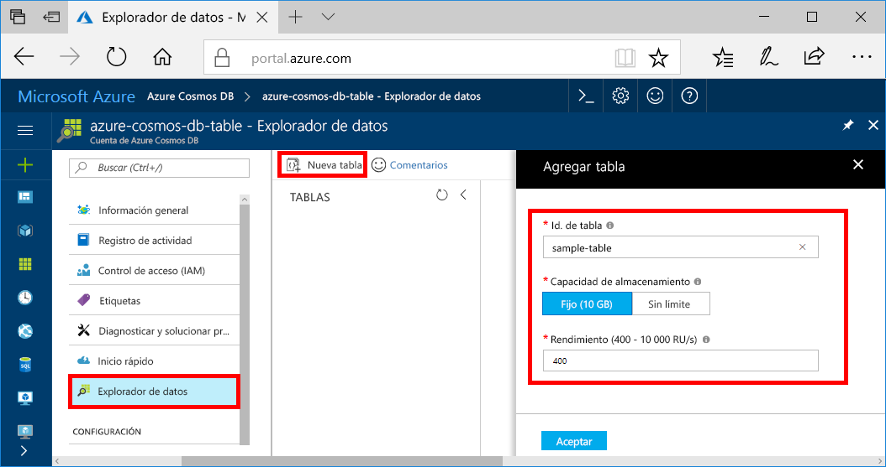

Ahora puede usar el Explorador de datos para crear una tabla y agregar datos a la base de datos. 

1. En Azure Portal, en el menú de navegación, haga clic en **Explorador de datos (versión preliminar)**. 
2. En la hoja Explorador de datos, haga clic en **Nueva tabla** y rellene la página con la información siguiente.

    

    Configuración|Valor sugerido|Descripción
    ---|---|---
    Id. de tabla|sample-table|Identificador de la nueva tabla. Los nombres de tabla tienen los mismos requisitos de caracteres que los identificadores de base de datos. Los nombres de bases de datos deben tener entre 1 y 255 caracteres y no pueden contener `/ \ # ?` o un espacio al final.
    Capacidad de almacenamiento| 10 GB|Deje el valor predeterminado. Se trata de la capacidad de almacenamiento de la base de datos.
    Rendimiento|400 RU|Deje el valor predeterminado. Más adelante se puede escalar verticalmente el [rendimiento](../articles/cosmos-db/request-units.md) si quiere reducir la latencia.

3. Una vez que haya rellenado el formulario, haga clic en **Aceptar**.