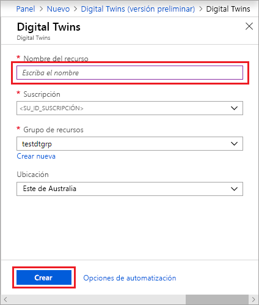
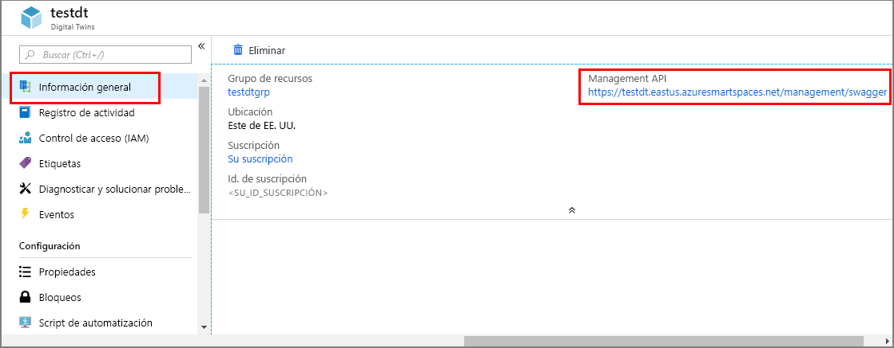

1. Inicie sesión en el [Azure Portal](http://portal.azure.com).

1. En el panel de navegación izquierdo, haga clic en **Crear un recurso**. Busque *Digital Twins* y seleccione **Digital Twins (preview)** (Digital Twins [versión preliminar]). Haga clic en **Crear** para iniciar el proceso de implementación.

    

1. En el panel **Digital Twins**, escriba la siguiente información:
   * **Nombre del recurso**: cree un nombre único para la instancia de Digital Twins.
   * **Suscripción**: elija la suscripción que quiere usar para crear esta instancia de Digital Twins. 
   * **Grupo de recursos**: seleccione o cree un [grupo de recursos](https://docs.microsoft.com/azure/azure-resource-manager/resource-group-overview#resource-groups) para la instancia de Digital Twins.
   * **Ubicación**: seleccione la ubicación más cercana a sus dispositivos.

    

1. Revise la información de Digital Twins y, luego, haga clic en **Crear**. La instancia de Digital Twins podría tardar unos minutos en crearse. Puede ver el progreso en el panel **Notificaciones**.

1. Abra el panel **Información general** de la instancia de Digital Twins. Observe el vínculo que se muestra en la sección **API de administración**.

    1. La dirección URL de la **API de administración** se formatea como: **_https://yourDigitalTwinsName.yourLocation.azuresmartspaces.net/management/swagger_**. Esta dirección URL le lleva a la documentación de la API REST de Azure Digital Twins que se aplica a la instancia. Lea [Uso de Azure Digital Twins Swagger](../articles/digital-twins/how-to-use-swagger.md) para aprender a leer y usar esta documentación de API.

    1. Modifique la dirección URL de la **API de administración** a este formato: **_https://yourDigitalTwinsName.yourLocation.azuresmartspaces.net/management/api/v1.0/_**. La aplicación usará la dirección URL modificada como dirección URL base para acceder a la instancia. Copie esta dirección URL modificada en un archivo temporal. La necesitará en la próxima sección.

    