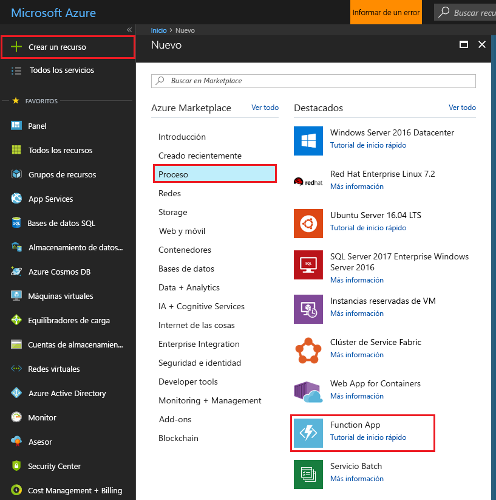

1. Vaya a [Azure Portal](https://portal.azure.com) e inicie sesión con su cuenta de Azure.

2. Haga clic en **+Nuevo**  >  **Compute** > **Function App**, seleccione su **Suscripción**, escriba un **Nombre de la aplicación** único, que identifica la aplicación de función, y especifique la siguiente configuración:
   
   * **[Grupo de recursos](../articles/azure-resource-manager/resource-group-overview.md)**: seleccione **Crear nuevo** y escriba un nombre para el nuevo grupo de recursos. 
   * **[Plan de hospedaje](../articles/app-service/azure-web-sites-web-hosting-plans-in-depth-overview.md)**, que puede ser cualquiera de los siguientes: 
     * **Plan de consumo**: el tipo de plan predeterminado para Azure Functions. Al elegir un plan de consumo, también debe elegir la ubicación en el campo **Ubicación** y establecer el valor de **Asignación de memoria** (en MB). Para más información sobre cómo afecta la asignación de memoria a los costos, consulte [Precios de Functions](https://azure.microsoft.com/pricing/details/functions/). 
     * **Plan de App Service**: este plan requiere que se cree un **plan de App Service/ubicación** o se seleccione uno existente. Esta configuración determina la [ubicación, las características, el costo y los recursos de proceso](https://azure.microsoft.com/pricing/details/app-service/) asociados a la aplicación.  
   * **Cuenta de almacenamiento**: cada aplicación de función requiere una cuenta de almacenamiento. Puede elegir una cuenta de almacenamiento existente o [crear una](../articles/storage/storage-create-storage-account.md#create-a-storage-account). 
     
    

3. Haga clic en **Crear** para aprovisionar e implementar la nueva función de aplicación.  