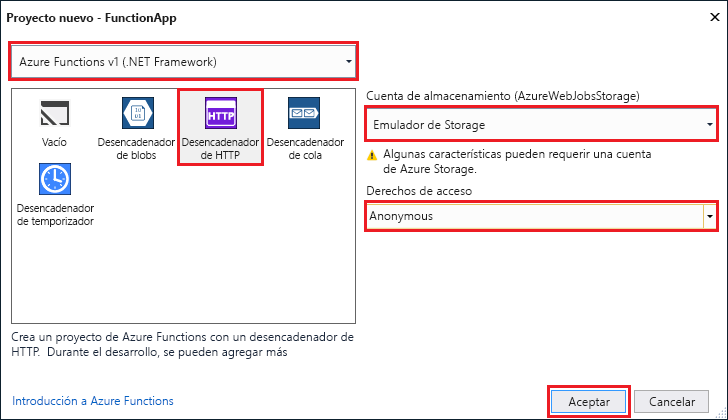

La plantilla del proyecto de Azure Functions de Visual Studio crea un proyecto que se puede publicar en una aplicación de función en Azure. Una aplicación de función permite agrupar funciones como una unidad lógica para la administración, la implementación y el uso compartido de recursos.

1. En Visual Studio, seleccione **Nuevo** > **proyecto** en el menú **Archivo**.

2. En el cuadro de diálogo **Nuevo proyecto**, seleccione **Instalado**, expanda **Visual C#** > **Nube**, seleccione **Azure Functions**, escriba un **nombre** para el proyecto y haga clic en **Aceptar**. El nombre de la aplicación de función debe ser válido como espacio de nombres de C#, por lo que no debe usar guiones bajos, guiones u otros caracteres no alfanuméricos.

    

3. Use la configuración especificada en la tabla que aparece después de la imagen.

     

    | Configuración      | Valor sugerido  | DESCRIPCIÓN                      |
    | ------------ |  ------- |----------------------------------------- |
    | **Versión** | Azure Functions v1  (.NET Framework) | Con esto se crea un proyecto de función que usa la versión 1 del entorno de ejecución de Azure Functions. La versión 2 del entorno de ejecución, que admite .NET Core, se encuentra actualmente en versión preliminar. Para más información, consulte [Cómo seleccionar un destino para versiones en tiempo de ejecución de Azure Functions](../articles/azure-functions/functions-versions.md).   |
    | **Plantilla** | Desencadenador HTTP | Con esto se crea una función desencadenada por una solicitud HTTP. |
    | **Cuenta de almacenamiento**  | Emulador de Storage | Un desencadenador HTTP no usa la conexión de la cuenta de Storage. Todos los demás tipos de desencadenador requieren una cadena de conexión de cuenta de Storage válida. |
    | **Derechos de acceso** | Anónimas | Cualquier cliente puede desencadenar una función creada sin tener que proporcionar una clave. Esta configuración de autorización facilita probar la función nueva. Para más información sobre las claves y la autorización, consulte [Claves de autorización](../articles/azure-functions/functions-bindings-http-webhook.md#authorization-keys) en los [enlaces HTTP y de webhook](../articles/azure-functions/functions-bindings-http-webhook.md). |
4. Haga clic en **Aceptar** para crear el proyecto de función y la función desencadenada por HTTP.

