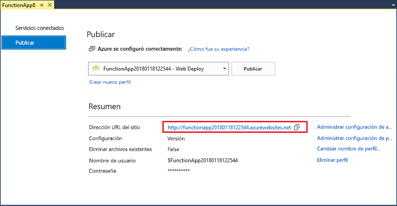

1. En el **Explorador de soluciones**, haga clic con el botón derecho en el proyecto y seleccione **Publicar**. Elija **Crear nuevo** y, luego, **Publicar**. 

    

2. Si todavía no conectó Visual Studio a su cuenta de Azure, seleccione **Agregar una cuenta...**.  

3. En el cuadro de diálogo **Crear App Service**, use la configuración de **Hospedaje**, tal y como se especifica en la siguiente tabla: 

    

    | Configuración      | Valor sugerido  | DESCRIPCIÓN                                |
    | ------------ |  ------- | -------------------------------------------------- |
    | **Nombre de aplicación** | Nombre único globalmente | Nombre que identifica de forma única la nueva aplicación de función. |
    | **Suscripción** | Elija una suscripción | La suscripción de Azure que se va a usar. |
    | **[Grupo de recursos](../articles/azure-resource-manager/resource-group-overview.md)** | myResourceGroup |  Nombre del grupo de recursos en el que se va a crear la aplicación de función. Elija **Nuevo** para crear un grupo de recursos nuevo.|
    | **[Plan de App Service](../articles/azure-functions/functions-scale.md)** | Plan de consumo | Asegúrese de que elige **Consumo** en **Tamaño** después de hacer clic en **Nuevo** para crear un plan. Además, elija una **ubicación** en una [región](https://azure.microsoft.com/regions/) cercana a usted o a otros servicios a los que acceden las funciones.  |

    >[!NOTE]
    >El entorno de ejecución de Functions necesita una cuenta de Azure Storage. Por este motivo, se crea una cuenta de Azure Storage nueva cuando crea una aplicación de función.

4. Haga clic en **Crear** para crear una aplicación de función y los recursos relacionados en Azure con esta configuración e implemente el código del proyecto de función. 

5. Una vez finalizada la implementación, anote el valor de la **dirección URL del sitio**, que es la dirección de la aplicación de función en Azure.

    
