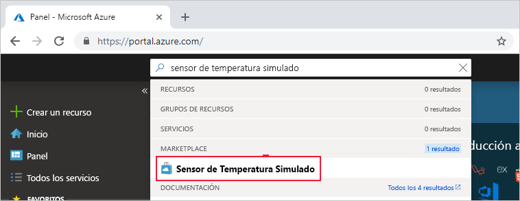

Una de las funcionalidades clave de Azure IoT Edge es que puede implementar módulos en dispositivos de IoT Edge desde la nube. Un módulo de IoT Edge es un paquete ejecutable que se implementa como un contenedor. En esta sección, se va a implementar un módulo pregenerado desde la [sección de módulos de IoT Edge de Azure Marketplace](https://azuremarketplace.microsoft.com/en-us/marketplace/apps/category/internet-of-things?page=1&subcategories=iot-edge-modules). Este módulo genera telemetría para el dispositivo simulado.

1. En Azure Portal, escriba `Simulated Temperature Sensor` en el cuadro de búsqueda y abra el resultado de Marketplace.

   

2. En el campo **Subscripción**, seleccione la suscripción con la instancia de IoT Hub que está utilizando, si es que no lo está ya.

3. En el campo **IoT Hub**, seleccione el nombre de la instancia de IoT Hub que está usando, si es que no lo está ya.

4. Haga clic en **Buscar dispositivo**, seleccione el dispositivo IoT Edge (llamado `myEdgeDevice`) y, a continuación, seleccione **Crear**.

5. En el paso **Agregar módulos** del asistente, haga clic en el módulo **SimulatedTemperatureSensor** para comprobar los ajustes de configuración, haga clic en **Guardar** y seleccione **Siguiente**.

6. En el paso **Especificar rutas** del asistente, compruebe que las rutas están correctamente configuradas con la ruta predeterminada que envíe todos los mensajes de todos los módulos a IoT Hub (`$upstream`). Si no es así, agregue el código siguiente y seleccione **Next** (Siguiente).

   ```json
    {
    "routes": {
        "route": "FROM /messages/* INTO $upstream"
        }
    }
   ```

7. En el paso **Review Deployment** (Revisar implementación) del asistente, seleccione **Submit** (Enviar).

8. Vuelva a la página de detalles del dispositivo y seleccione **Actualizar**. Además del módulo edgeAgent que se creó cuando inició por primera vez el servicio, debería ver otro módulo de entorno de ejecución llamado **edgeHub** y el módulo **tempSensor** en la lista.

   Los nuevos módulos pueden tardar unos minutos en mostrarse. El dispositivo IoT Edge debe recuperar su nueva información de implementación de IoT Hub, iniciar los contenedores y, a continuación, notificar su nuevo estado a IoT Hub. 

   
