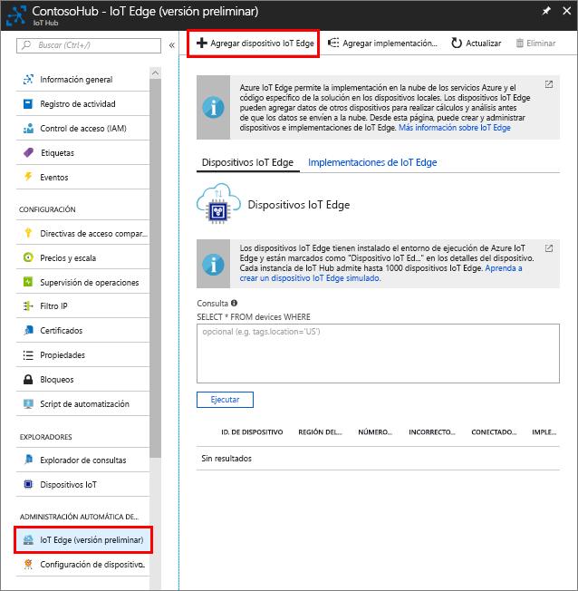

Cree una identidad para el dispositivo simulado, con el fin de que pueda comunicarse con su centro de IoT. Dado que los dispositivos de IoT Edge se comportan y se pueden administrar de manera diferente a los dispositivos de IoT típicos, declare que este es un dispositivo de IoT Edge desde el principio. 

1. En Azure Portal, navegue hasta el centro de IoT.
1. Seleccione **IoT Edge** y, a continuación, **Agregar dispositivo IoT Edge**.

   

1. Asigne el dispositivo simulado un identificador de dispositivo único.
1. Seleccione **Guardar** para agregar su dispositivo.
1. Seleccione el dispositivo nuevo en la lista de dispositivos.
1. Copie el valor de **Cadena de conexión: clave principal** y guárdelo. Este valor se usará para configurar el runtime de IoT Edge en la sección siguiente. 

