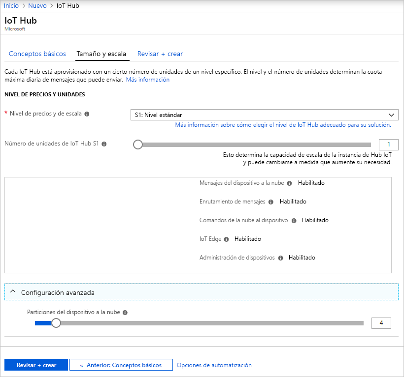
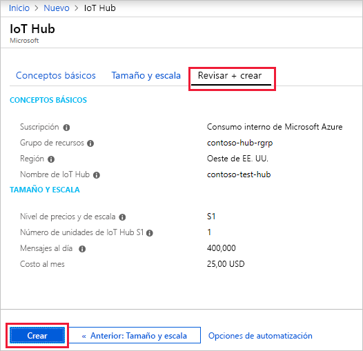

En esta sección se describe cómo crear un centro de IoT mediante [Azure Portal](https://portal.azure.com).

1. Inicie sesión en [Azure Portal](https://portal.azure.com). 

2. Elija **+ Crear un recurso** y, a continuación, **Internet de las cosas**.

3. Haga clic en **Centro de Iot** en la lista de la derecha. Verá la primera pantalla para crear un centro de IoT.

   

   Rellene los campos.

   **Subscription** (Suscripción): seleccione la suscripción que se usará con su centro de IoT.

   **Resource Group** (Grupo de recursos): puede crear un grupo de recursos o usar uno ya existente. Para crear uno, haga clic en **Create new** (Crear) y escriba el nombre que quiere usar. Para usar un grupo de recursos existente, haga clic en **Use existing** (Usar existente) y seleccione el grupo de recursos de la lista desplegable. Para más información, consulte [Administración de los recursos de Azure a través del Portal](../articles/azure-resource-manager/resource-group-portal.md).

   **Region** (Región): es la región en la que quiere ubicar el centro. Seleccione la ubicación más cercana a usted en la lista desplegable.

   **IoT Hub Name** (Nombre del centro de IoT): escriba el nombre del centro de IoT. Este nombre debe ser único globalmente. Si el nombre que escribe está disponible, aparece una marca de verificación verde.

   [!INCLUDE [iot-hub-pii-note-naming-hub](iot-hub-pii-note-naming-hub.md)]

4. Haga clic en **Next: Size and scale** (Siguiente: tamaño y escala) para seguir con la creación del centro de IoT.

   

   En esta pantalla, puede aceptar los valores predeterminados y hacer clic en **Review + create** (Revisar y crear) en la parte inferior. 

   **Pricing and scale tier** (Nivel de precios y de escala): puede elegir entre varios niveles, en función del número de características que quiera y el número de mensajes que envíe mediante su solución al día. El nivel gratis está pensado para la prueba y evaluación. Permite la conexión de 500 dispositivos con el centro de IoT y hasta 8000 mensajes al día. Cada suscripción a Azure puede crear una instancia de IoT Hub en el nivel gratis. 

   **IoT Hub units** (Unidades de IoT Hub): el número de mensajes que se permiten por unidad y por día depende del plan de tarifa del centro. Por ejemplo, si desea que el Centro de IoT admita la entrada de 700 000 mensajes, elija dos unidades del nivel de S1.

   Para más información sobre las demás opciones del nivel, consulte la sección [Elección del nivel correcto de IoT Hub](../articles/iot-hub/iot-hub-scaling.md).

   **Advanced / Device-to-cloud partitions** (Particiones avanzadas/de dispositivo a nube): esta propiedad relaciona los mensajes del dispositivo a la nube con el número de lectores simultáneos de los mensajes. La mayoría de los centros de IoT solo necesitan cuatro particiones. 

5. Haga clic en **Review + create** (Revisar y crear) para revisar sus selecciones. Verá algo parecido a esta pantalla.

   

6. Haga clic en **Create** (Crear) para crear el centro de IoT. Esta operación tarda unos minutos.
