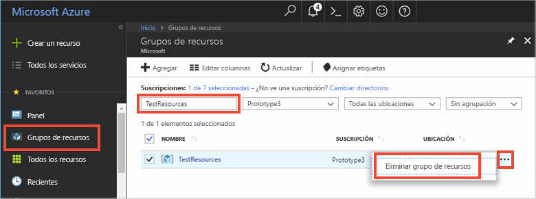

Si va a seguir con el siguiente artículo recomendado, puede mantener los recursos que ya ha creado y volverlos a utilizar.

En caso contrario, puede eliminar los recursos de Azure que creó en este artículo para evitar gastos. 

> [!IMPORTANT]
> La eliminación de un grupo de recursos es irreversible. El grupo de recursos y todos los recursos contenidos en él se eliminan permanentemente. Asegúrese de no eliminar por accidente el grupo de recursos o los recursos equivocados. Si ha creado una instancia de IoT Hub en un grupo de recursos ya existente que contiene recursos que desea conservar, puede eliminar solo esa instancia en lugar de eliminar todo el grupo de recursos.
>

Para eliminar un grupo de recursos por el nombre:

1. Inicie sesión en el [Portal de Azure](https://portal.azure.com) y haga clic en **Grupos de recursos**.

2. Escriba el nombre del grupo de recursos que contiene la instancia de IoT Hub en el cuadro de texto **Filtrar por nombre...**. 

3. A la derecha del grupo de recursos de la lista de resultados, haga clic en **...** y, a continuación, en **Eliminar grupo de recursos**.

    

4. Se le pedirá que confirme la eliminación del grupo de recursos. Escriba otra vez el nombre del grupo de recursos para confirmar y haga clic en **Eliminar**. Transcurridos unos instantes, el grupo de recursos y todos los recursos que contiene se eliminan.