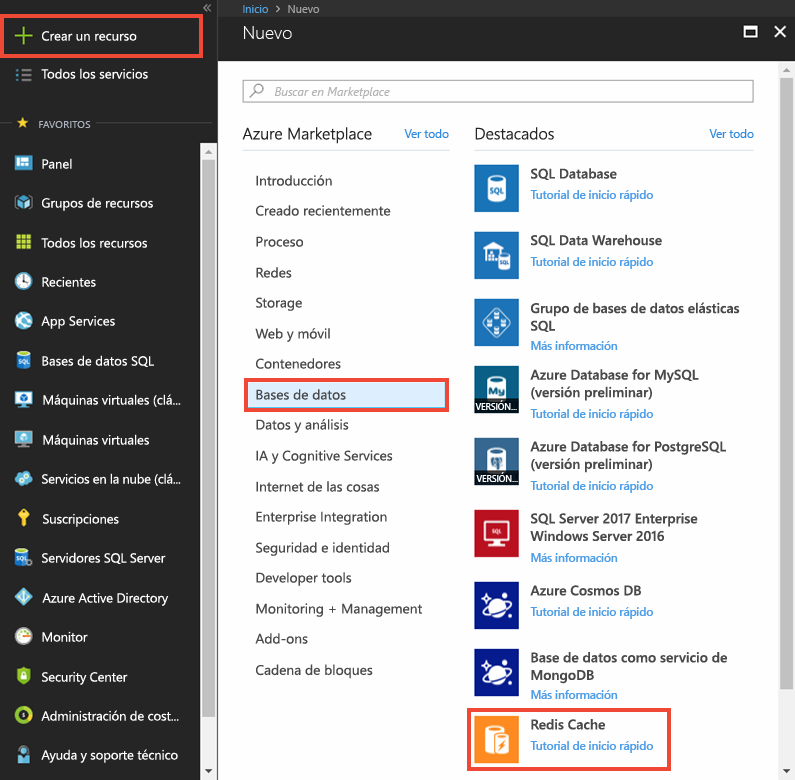
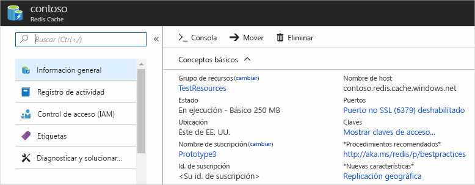

Para crear una memoria caché, primero inicie sesión en [Azure Portal](https://portal.azure.com) y haga clic en **Crear un recurso** > **Bases de datos** > **Redis Cache**.

En **Nueva Redis Cache**, configure las opciones de la nueva caché.

| Configuración      | Valor sugerido  | DESCRIPCIÓN |
| ------------ |  ------- | -------------------------------------------------- |
| **Nombre DNS** | Nombre único globalmente | El nombre de la memoria caché debe ser una cadena de entre 1 y 63 caracteres y solo puede contener números, letras y el carácter `-` . El nombre de la memoria caché no puede comenzar ni terminar por el carácter `-` y no se pueden usar varios caracteres `-` consecutivos.  | 
| **Suscripción** | Su suscripción | Se crea la suscripción en la instancia de Azure Redis Cache. | 
| **Grupo de recursos** |  *TestResources* | Nombre del nuevo grupo de recursos en el que se va a crear la caché. Al colocar todos los recursos de una aplicación en un grupo, puede administrarlos juntos. Por ejemplo, si elimina el grupo de recursos también se eliminarán todos los recursos asociados con la aplicación. | 
| **Ubicación** | Este de EE. UU | Elija una [región](https://azure.microsoft.com/regions/) cerca de otros servicios que vayan a usar la memoria caché. |
| **[Plan de tarifa](https://azure.microsoft.com/pricing/details/cache/)** |  C0 para básico (caché de 250 MB) |  El plan de tarifa determina el tamaño, el rendimiento y las características disponibles de la memoria caché. Para obtener más información, consulte [Azure Redis Cache Overview](../articles/redis-cache/cache-overview.md) (Información general de Azure Redis Cache). |
| **Anclar al panel** |  Seleccionado | Si hace clic en la opción para anclar la nueva caché, la búsqueda será aún más fácil. |

 

Una vez que las nuevas opciones de caché estén configuradas, haga clic en **Crear**. 

La creación de la caché puede tardar unos minutos. Para comprobar el estado, puede supervisar el progreso en el panel. Después de crear la memoria caché, tendrá el estado **En ejecución** y estará lista para su uso.

