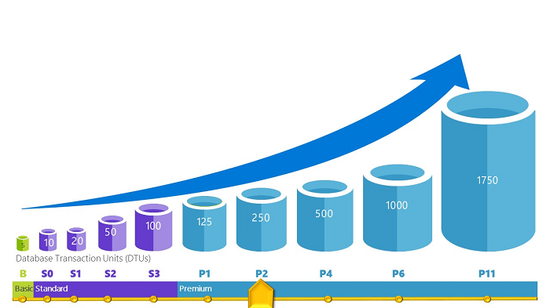

La unidad de procesamiento de la base de datos (DTU) es la unidad de medida de Base de datos SQL que representa la potencia relativa de una base de datos para procesar las transacciones según las limitaciones del hardware que controla la base de datos. DTU es un concepto similar a caballos de fuerza en un automóvil. Describe el rendimiento relativo de una base de datos con respecto a otra. Al igual que con los caballos de fuerza de un coche, cuantas más DTU tenga una base de datos, más potencia tendrá. Los caballos de fuerza dependen de muchos factores diferentes: peso, capacidad, turbocompresor, sistema de escape. De forma similar, la DTU depende de la cantidad y el tipo de memoria, el proceso y el disco que puede consumir la base de datos. Puede leer los detalles de cómo determinamos la DTU en el [Información general de la prueba comparativa](https://msdn.microsoft.com/library/azure/dn741327.aspx)).

Ejemplo: una base de datos de nivel Básico tiene 5 DTU, lo que significa que tiene relativamente mucha menos capacidad de rendimiento de las transacciones que una base de datos Premium P11, que tiene 1750 DTU.

DTU para bases de datos únicas se convierte directamente en eDTU para bases de datos elásticas. Por ejemplo, una base de datos de un grupo de bases de datos elásticas de tipo Básico ofrece hasta 5 eDTU. Es el mismo rendimiento que una base de datos única de tipo Básica. La diferencia es que la base de datos flexible no consumirá ninguna eDTU del grupo hasta que tenga que hacerlo.

Un ejemplo sencillo ayuda. Utilice un grupo de bases de datos elásticas de tipo Básico con 1000 DTU y coloque 800 bases de datos en él. Siempre y cuando se usen solamente 200 de las 800 bases de datos en un momento dado (5 DTU X 200 = 1000), no se alcanzará la capacidad del grupo y el rendimiento de la base de datos no se degradará. Este es un ejemplo simplificado para mayor claridad. Los cálculos matemáticos reales son un poco más complicados. El portal realiza los cálculos matemáticos y hace una recomendación basándose en el uso histórico de la base de datos. Vea [Consideraciones de precio y rendimiento para un grupo de bases de datos elásticas](../articles/sql-database/sql-database-elastic-pool-guidance.md) para saber cómo funcionan las recomendaciones o para realizar los cálculos matemáticos por su cuenta.

<!---HONumber=Oct15_HO2-->