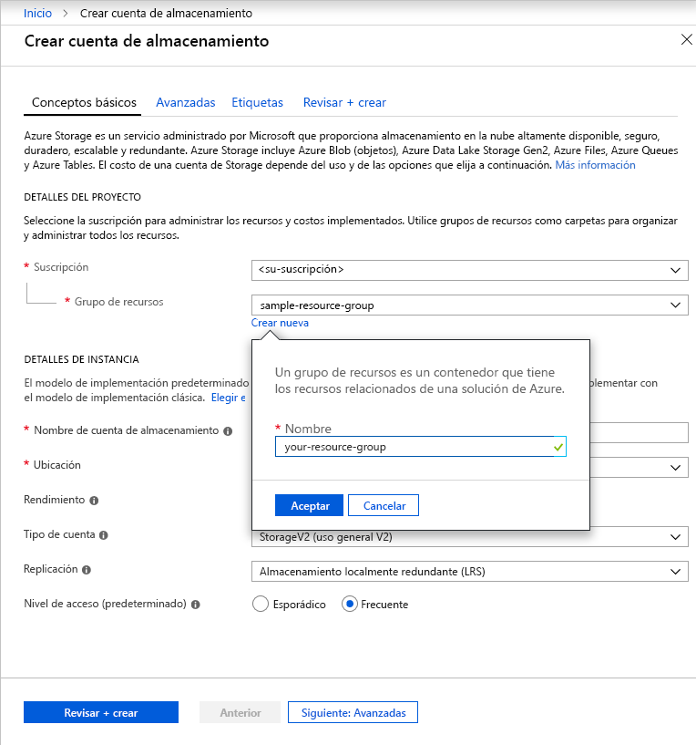

Para crear una cuenta de almacenamiento de uso general v2 en Azure Portal, siga estos pasos:

1. En Azure Portal, expanda el menú de la izquierda para abrir el menú de servicios y elija **Todos los servicios**. Desplácese hacia abajo hasta **Almacenamiento** y elija **Cuentas de almacenamiento**. En la ventana **Cuentas de almacenamiento** que aparece, elija **Agregar**.
1. Seleccione la suscripción en la que se va a crear la cuenta de almacenamiento.
1. En el campo **Grupo de recursos**, haga clic en **Crear nuevo**. Escriba un nombre para el nuevo grupo de recursos, como se muestra en la siguiente imagen.

    

1. Después, escriba un nombre para la cuenta de almacenamiento. El nombre que elija debe ser único en Azure, tener entre tres y 24 caracteres y solo pueden contener números y letras minúsculas.
1. Seleccione una ubicación para la cuenta de almacenamiento o utilice la ubicación predeterminada.
1. Deje estos campos con sus valores predeterminados:
    - De manera predeterminada, el **Modelo de implementación** se establece en **Resource Manager**.
    - El campo **Rendimiento** se establece en **Estándar** de forma predeterminada.
    - De manera predeterminada, el campo **Tipo de cuenta** se establece en **StorageV2 (uso general v2)**.
    - De manera predeterminada, el campo **Replicación** se establece en **Almacenamiento con redundancia local (LRS)**.
    - El **nivel de acceso** se establece en **Frecuente** de forma predeterminada.

1. Haga clic en **Revisar y crear** para revisar la configuración de la cuenta de almacenamiento y crear la cuenta.
1. Haga clic en **Create**(Crear).

Para obtener más información sobre los tipos de cuentas de almacenamiento y otros parámetros de la cuenta de almacenamiento, consulte [Introducción a las cuentas de Azure Storage](https://docs.microsoft.com/azure/storage/common/storage-account-overview). Para más información sobre los grupos de recursos, consulte [Información general de Azure Resource Manager](https://docs.microsoft.com/azure/azure-resource-manager/resource-group-overview). 
