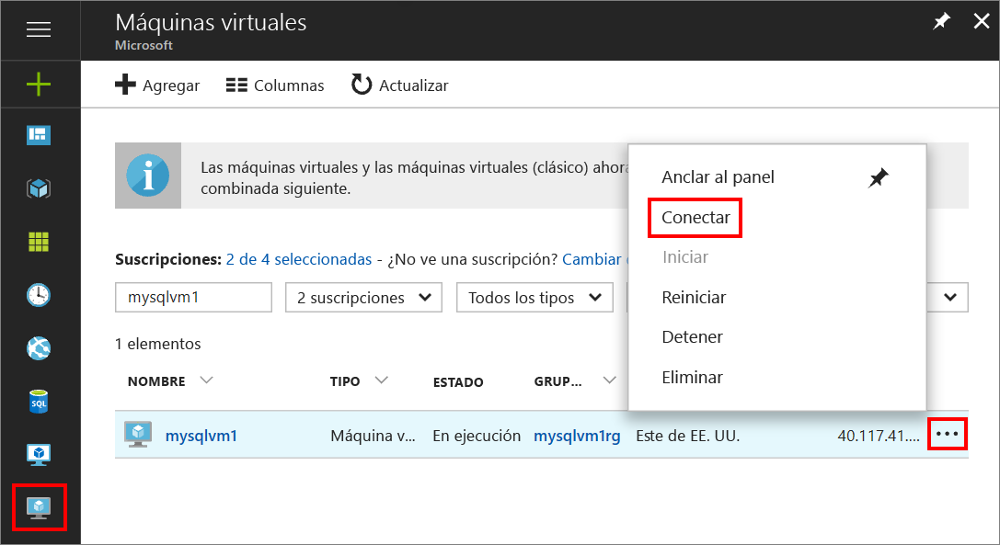
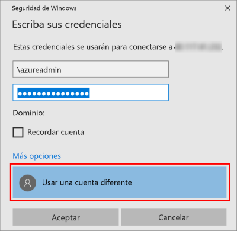

Use los pasos siguientes para conectarse a la máquina virtual de SQL Server con Escritorio remoto:

1. Una vez creada y en ejecución la máquina virtual de Azure, haga clic en el icono Máquinas virtuales en Azure Portal para ver las máquinas virtuales.

1. Haga clic en el botón de puntos suspensivos, **...** , de la nueva máquina virtual.

1. Haga clic en **Conectar**.

   

1. Abra el archivo **RDP** que ha descargado el explorador para la máquina virtual.

1. La conexión a Escritorio remoto le avisará de que no se puede identificar el publicador de esta conexión remota. Haga clic en **Conectar** para continuar.

1. En el cuadro de diálogo **Seguridad de Windows**, haga clic en **Usar una cuenta diferente**. Es posible que deba hacer clic en **Más opciones** para verlo. Use el nombre de usuario y la contraseña que configuró al crear la máquina virtual. Debe agregar una barra diagonal inversa delante del nombre de usuario.

   

Después de conectarse a la máquina virtual de SQL Server, puede iniciar SQL Server Management Studio y conectarse con la autenticación de Windows mediante sus credenciales de administrador local. Si ha habilitado la autenticación de SQL Server, también puede conectarse con la autenticación de SQL mediante el inicio de sesión de SQL y la contraseña configurada durante el aprovisionamiento.

El acceso a la máquina le permite cambiar directamente la máquina y la configuración de SQL Server según sus necesidades. Por ejemplo, podría configurar el firewall o cambiar la configuración de SQL Server.